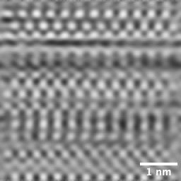

# Scanning Tunneling Microscope
# Authors 
- Paweł Chmolewski
# Description of the project 
Scanning tunneling microscope is a tool capable of imaging conductive surfaces with atomic resolution in the air. The STM is based on concept of quantum tunneling effect.

This type of microscope works in two operating modes:
- Constant height mode
- Constant current mode
  
# Science and tech used 

## Electronics

| STM circuit overview |
| --- |
|  |

The amplifiers used in the circuit are powered from symmetric power supply which has the input EMI filter.

| STM Piezo Driver |
| --- |
|  |

The piezo driver is responsible for tip movement. It controls the movement of the piezo buzzer by generating signals Z+X, Z-X, Z+Y, Z-Y based on provided input signals X, Y, Z provided by Analog Discovery. The STM Scan Head brass electrode plate is connected to ground, and is used to shield the STM tip from the scan electrodes.

| STM Preamplifier |
| --- |
|  |

The STM preamplifier is based on op-amp OPA124. This op-amp works nonlinear, unstable in case of high input currents but what's more important it has low input bias current around 1 pA and low current noise. Another, probably more stable and worth of testing op-amp is OPA627.

The bias voltage is applied between tip and the sample. Since the tip potential is assumed to be 0, the negative potential is applied to the sample and it comes from the negative output of symmetric power supply, its value is regulated by the potentiometer. 

## Software

| Scan raster method |
| --- |
|  |
| The scan raster method used in current version of the software. [[1]](#1) |

The scan raster method consist of generated by Analog Discovery positive triangular waveform for x-axis and positive sawtooth waveform also called ramp waveform for y-axis. The python code which controls the scan raster method and data acquisition is contained in the file `STM.py`.

# State of the art

The STM tip needs to be atomically sharp. The current method used for creating such tip is easiest and the fastest. It relies on cutting in this case 30 AWG tungsten wire at a 45° angle with a pair of sharp wire cutters.

| STM Scan Head |
| --- |
|  |
| The input of the preamplifier which is mounted on a STM scan head requires good insulation. It is only connected to the needle and the input node of the op-amp is insulated by air wiring technique. During the data collection, the STM scan head is covered with metal can to provide EMI shielding. |

| STM Vibration Isolation |
| --- |
|  |
| The good vibration isolation is essential for STM. Smallest mechanical oscillations affect on tip-sample distance and may cause that the tip crash into the sample. |

| Scanning Tunneling Microscope configuration |
| --- |
|  |

The scan was taken at constant height mode with a resolution of 256 x 256 pixels, the bias voltage was 50 mV. Next, the image was gaussian filtered, corrected for vertical drift and sharpened using application Gwyddion.

| The image of HOPG |
| --- |
|  |
| The acquired image of Highly Oriented Pyrolytic Graphite. |

# What next?
The current version of microscope works in constant height mode. It could be developed by software modifications. The change of scan raster method may improve image quality. Introducing a feedback loop which controls the voltage applied to the Z-axis electrode of the piezo scanner to maintain a constant tunneling current, allows it to operate in constant current mode. To protect STM scanning tip from accidental crashing into the sample, coarse approach might be motorized and controllled by the software. To provide better quality images, the noise could be reduced by building soundproof box.
# Sources
- [Dan Berard](https://dberard.com)
- [Raspberry Pi](https://www.raspberrypi.org/help/)
- [Analog Discovery](https://digilent.com/reference/software/waveforms/waveforms-3/start)
- <a id="1">[1]</a> Yik R. Teo, Yuen Yong, and Andrew J. Fleming, July 2018. A COMPARISON OF SCANNING METHODS AND THE VERTICAL CONTROL IMPLICATIONS FOR SCANNING PROBE MICROSCOPY. Asian Journal of Control, Vol. 20, No. 4, pp. 1352–1366, DOI: 10.1002/asjc.1422
- [Writing on GitHub](https://docs.github.com/en/get-started/writing-on-github)
